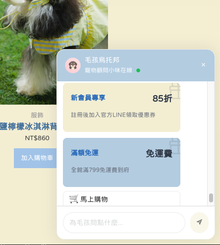

# 🐶 Chatbot Widget 專案總覽

這是一個多版本的聊天小工具專案，採用 React 技術開發，並提供 WordPress 整合版與純前端版本：




## 📁 專案目錄

- `react-vite-wp-plugin/`  
  **WordPress 外掛版本**，透過 REST API 連接 WordPress 資料庫取得聊天流程。
  此專案已拆分元件及撰寫原生 CSS。
  如需安裝外掛至 WordPress，請閱讀以下 README 其內部說明進行打包與上傳。
  🔗 詳細說明：[README](./chatbot-react-wp-plugin-control/README.md)

- `chatbot-react-vite-css-only-frontend/`  
  **純前端版本**，無需後端，適合 UI 測試或靜態展示。

  ```bash
  cd chatbot-react-vite-css-only-frontend
  npm install
  npm run dev
  ```

- `chatbot-use-nextjs-tailwindcss-only-frontend/`  
   **Next.js 使用 style 使用 tailwind**。
